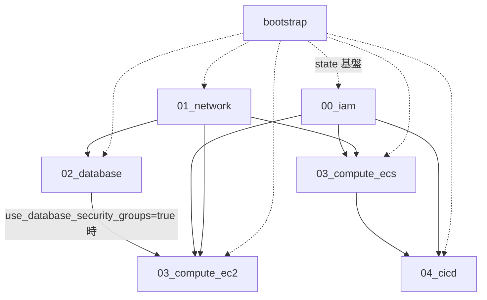

# AWS Terraform

`ap-northeast-1` 向けの Terraform 構成。`bootstrap/` でリモートステート基盤を作成し、`environments/prd/` を番号付きスタックに分割して管理する。

## ディレクトリ構成

| パス | 内容 |
|------|------|
| `bootstrap/` | リモートステート用 S3 バケット・DynamoDB ロックテーブル（初回のみ） |
| `modules/` | 再利用モジュール（VPC、SG、EC2、ECS、RDS、IAM、CI/CD など） |
| `environments/prd/` | 本番想定スタック（スタックごとに独立した state） |

## スタック一覧

| スタック | パス | 主なリソース | 参照する remote state |
|----------|------|--------------|------------------------|
| bootstrap | `bootstrap/` | S3（state）、DynamoDB（lock） | なし |
| 00_iam | `environments/prd/00_iam/` | EC2 用 IAM ロール、ECS タスク実行ロール | なし |
| 01_network | `environments/prd/01_network/` | VPC、サブネット、NAT、ルート | なし |
| 02_database | `environments/prd/02_database/` | RDS、web/db 用 SG | `01_network` |
| 03_compute_ec2 | `environments/prd/03_compute_ec2/` | EC2 | `00_iam`, `01_network`, （任意）`02_database` |
| 03_compute_ecs | `environments/prd/03_compute_ecs/` | ECS（Fargate）+ ALB、ECS/ALB 用 SG | `00_iam`, `01_network` |
| 04_cicd | `environments/prd/04_cicd/` | CodeCommit、ECR、CodeBuild、CodePipeline | `00_iam`, `03_compute_ecs` |

`modules/eip` は Elastic IP 用モジュールだが、現状どのスタックからも未参照。

## 依存関係



## apply 順

1. **bootstrap**（アカウント初回のみ）
2. **00_iam** と **01_network**（相互依存なし。並列可）
3. **02_database**（`01_network` 完了後）
4. **03_compute_ec2** と **03_compute_ecs**（`00_iam` + `01_network` 完了後。相互依存なし。並列可）
   - EC2 で `use_database_security_groups = true` の場合は **02_database** も先に apply すること
5. **04_cicd**（`03_compute_ecs` 完了後）

destroy は上記の逆順。

## 操作例

### bootstrap

```bash
cd terraform/aws/bootstrap
terraform init
terraform apply
```

### 各スタック

各スタックは `backend.hcl` と `terraform.tfvars` を持つ。`terraform.tfvars` に `terraform_state_bucket` / `terraform_state_key_prefix` を設定する。

```bash
cd terraform/aws/environments/prd/00_iam
terraform init -backend-config=backend.hcl
terraform plan
terraform apply
```

他スタックも同様に、対象ディレクトリで `init -backend-config=backend.hcl` → `plan` → `apply` を実行する。

state キー形式: `{terraform_state_key_prefix}/{スタック名}/terraform.tfstate`（例: `prd/01_network/terraform.tfstate`）

## 命名規則

| 対象 | 規則 | 例 |
|------|------|-----|
| Terraform 変数・モジュール引数 | `snake_case` | `container_port`, `host_port` |
| Terraform リソース属性（AWS provider） | provider 定義に従う | `container_port`（`aws_ecs_service.load_balancer`） |
| AWS API / JSON ペイロード | AWS 側のキー名 | `containerPort`, `hostPort`（タスク定義 JSON 内） |

Terraform 変数は `snake_case` に統一する。AWS API が camelCase を要求する箇所（ECS タスク定義 JSON など）のみ、リソースブロック内で AWS 形式を使う。

## モジュール

| モジュール | 用途 |
|------------|------|
| `networking` | VPC、サブネット、IGW、NAT |
| `sg` | EC2/RDS 用 web・db SG、ECS/ALB 用 SG |
| `iam` | EC2 インスタンスプロファイル、ECS タスク実行ロール |
| `ec2` | EC2 インスタンス |
| `ecs` | ECS クラスター、Fargate サービス、ALB、スタンドアロンタスク |
| `rds` | RDS PostgreSQL |
| `codecommit` / `ecr` / `codebuild` / `codepipeline` | CI/CD パイプライン |
| `eip` | Elastic IP（未接続） |
